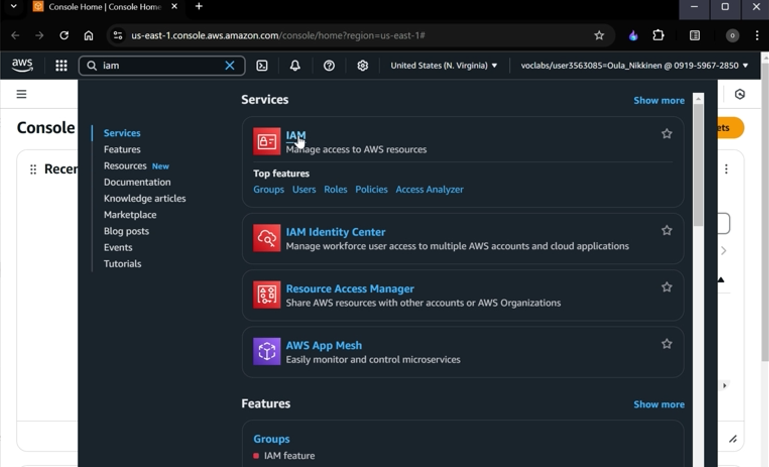

# Exploring Identity and Access Management (IAM) in AWS Academy Cloud Architecting simulation

Overview and objectives:

In this project, I explore users and groups and inspect the associated policies in the AWS Identity and Access Management (IAM) service. I also add users to the groups and verify the permissions that are inherited by them.

After completing, I am able to do the following:

- Explore pre-created IAM users and groups.
- Inspect IAM policies as they were applied to the pre-created groups.
- Follow a real-world scenario, while adding users to groups with specific capabilities enabled.
- Locate and use the IAM sign-in URL.
- Test the effects of policies on service access.

You can find full documentation [here](iam.ipynb)

